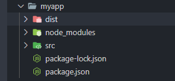

## Npm包管理工具

npm用于管理前端项目中的第三方js插件，基于package.json

`npm init` 创建项目

`npm install xxx | npm i xxx` 安装第三方js(npm install jquery)

> npm install -g xxx 全局安装 

`npm uninstall xxx | npm un xxx`  删除

`npm update xxx` 升级xxx包

> 可以使用cnpm代替

--------------

`npm i --save-dev xxx` 声明开发环境的依赖安装

------------------

目录结构:



dist: 存放前端编译结果

src: 存放源代码目录


打造一个全自动工具流，把src的前端项目编译到一个浏览器能够理解的项目放到dist目录下

> webpack, grunt, gulp这三个工具都能打造，以下使用gulp([https://www.gulpjs.com.cn/docs/getting-started/quick-start/](https://www.gulpjs.com.cn/docs/getting-started/quick-start/))

```bash
npm i -g gulp-cli
npm i --save-dev gulp //添加项目依赖项
npm i --save-dev gulp-typescript
```

创建一个文件指导这个过程（自动工具流打包）,创建gulpfile.js,在这个文件中将定义整个文件的编译工作流。

`npm install --save-dev browserify tsify vinyl-source-stream`

* browserify:能够将代码变成浏览器可以执行的版本

* tsify:browserify的一个插件，能够允许browserify执行typescript的代码

* vinyl-source-stream:文件流管理工具，能够把node-stream转换为gulpfile支持的管道中的流类型
